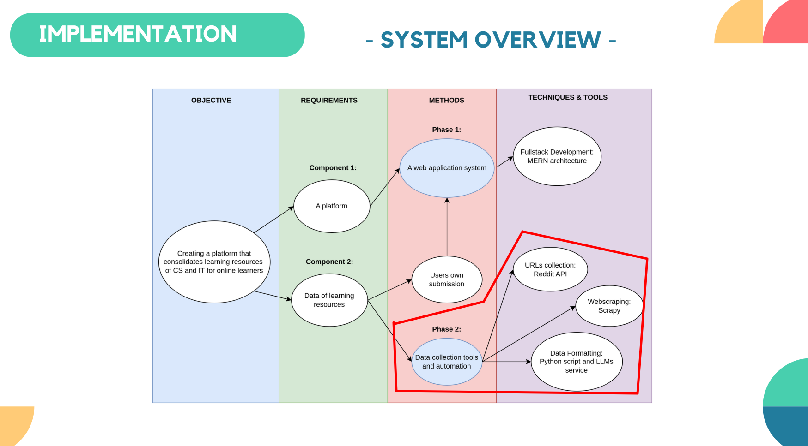
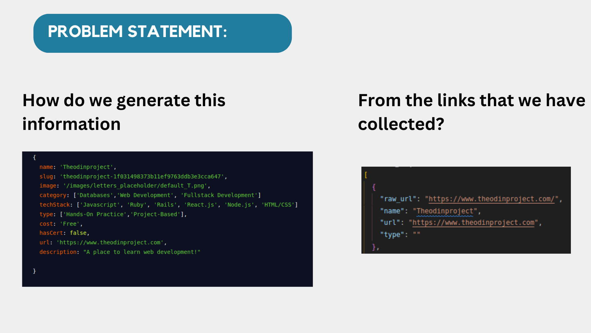
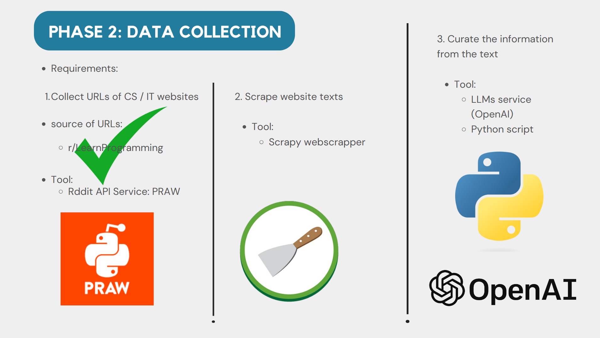
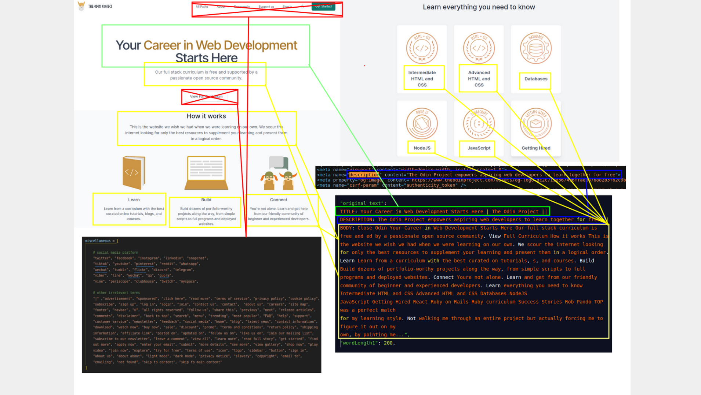
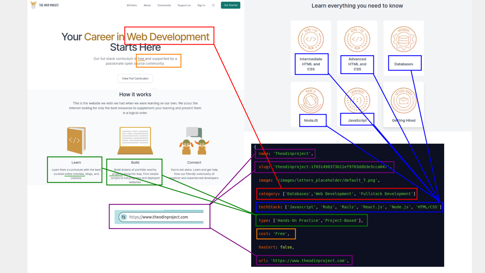
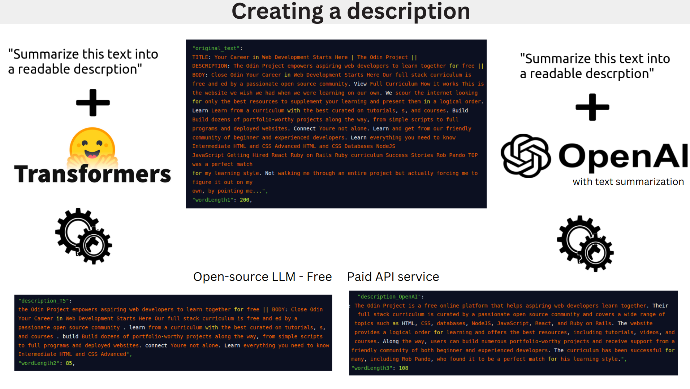
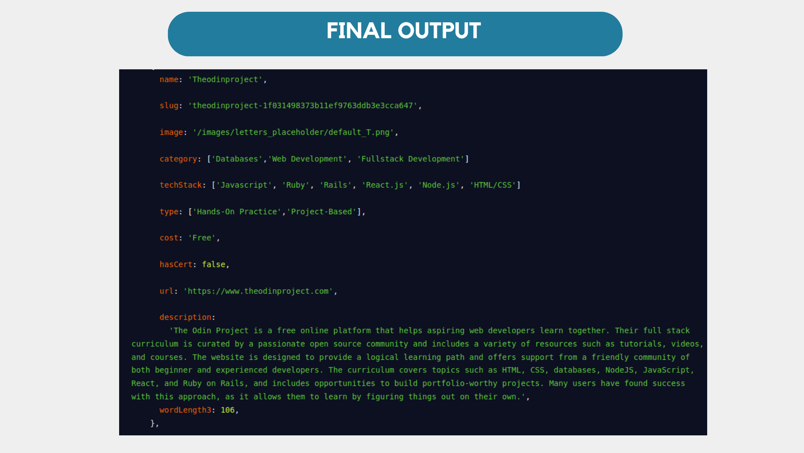
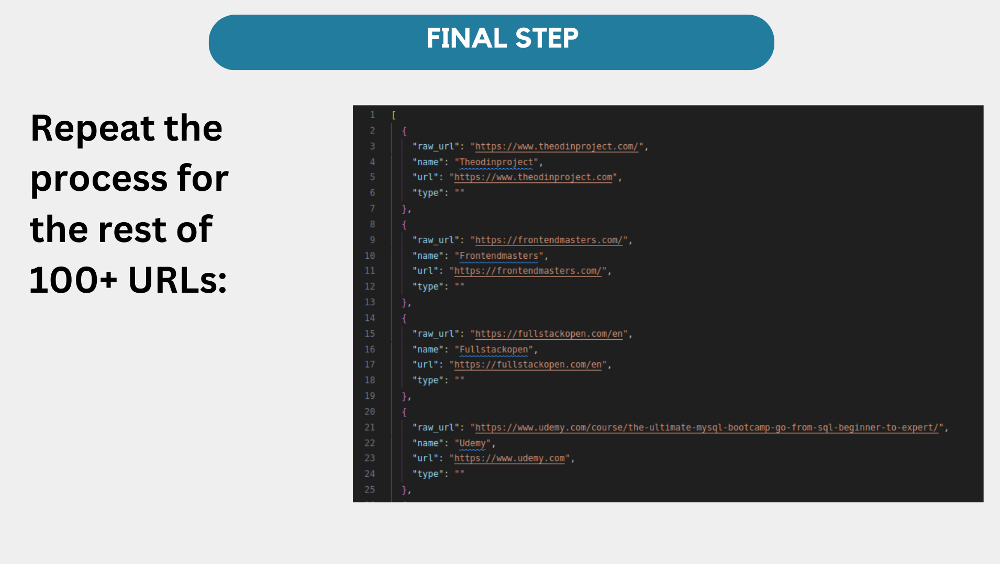

# Project Overview

This is the phase 2 of Educere web application system which involved building a scrapper to collect link resources from a specified source and curate the relevant information for each resource.

## Educere Srapper

Educere Scraper is a URL extractor and web scraper for the Educere web application system. The Educere web application is a full-stack platform that consolidates over 100 learning resources in Computer Science and Information Technology (CS/IT). These resources are sourced from r/LearnProgramming.

In Educere, users looking for CS/IT learning resources can navigate through a repository of over 100 options, with diverse selections and filter options.

To learn more about the application, visit the project [here](https://github.com/mirulh/Educere)

The main purpose of this Educere Scraper is to:

1. Collect URLs (websites related to CS and IT) from the subreddit r/LearnProgramming.
2. Process each URL to extract information about the website using web scraping.
3. Label each URL with data describing the website in terms of subject area, technologies offered, content types, cost, and a general description.

The data output at the will be seeded into Educere Web Application system

---

### Tools utilized: Scrapy, OpenAI API, Transformer T5, Reddit API, Python script

### Methods involved: Data processing, Data collection, Data scraping, Data cleaning, Data labeling, Data transformation

---

## 1. Problem Statement

- How to structure the output data with this information in a JSON format from the links that we have collected?

## 2. Methodologies - Data collection

- We employed 3 Steps to get the output desired.

1. Collect URLs from r/LearnProgramming using PRAW.
2. Scrape website texts:
   Extract the TITLE, DESCRIPTION, and BODY text from each URL's home page and combine them.
3. Curate relevant information from the texts:
   Use a Python script to scan the texts, recognize keywords for subjects, technologies, etc., and categorize them in JSON.
   Use Open Source LLMs or the OpenAI API to convert the raw texts into a readable description of the website.

## 3. Webscraping texts - Data scraping, Data cleaning

- (RIGHT - Data scraping) Using scrapy for webscraping, the script extracts all texts from the home page of the website and combine TITLE + DESCRIPTION + BODY together in one paragraph (raw text)
- (LEFT - Data cleaning) Using Python functions, the script analyzed the raw text and removed irrelevant keywords from the raw text that matches the keywords found in the 'miscellaneous' array. This will produce more accurate output at the end.

## 4. Data labeling

- Using a Python script, label the url with data scanned from the raw text that describes its contents (subjects, types, technologies, cost, and certificate)

## 5. Text Summarization - Data transformation

- Creating a readable description from the raw text using T5 LLM and OpenAI API
- In this picture we compare the quality of the description produce between T5 and OpenAI text summarization. We can conclude that OpenAI produce more accurate output description than T5

## 6. Displaying the final output

- This data can be seeded into Educere database properly as it follows the NoSQL structure

## 7. Apply the same step to the rest of URLs (by automation)

